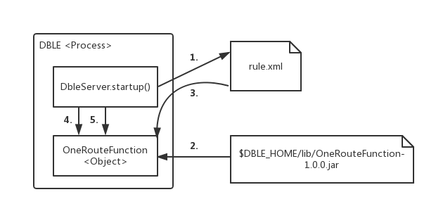
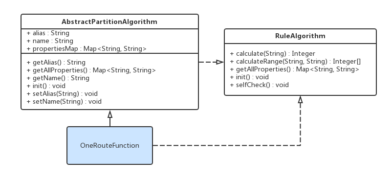
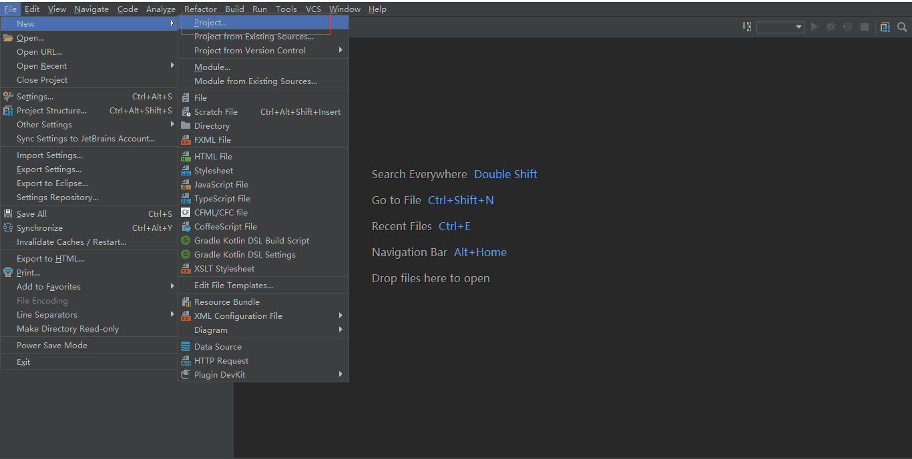
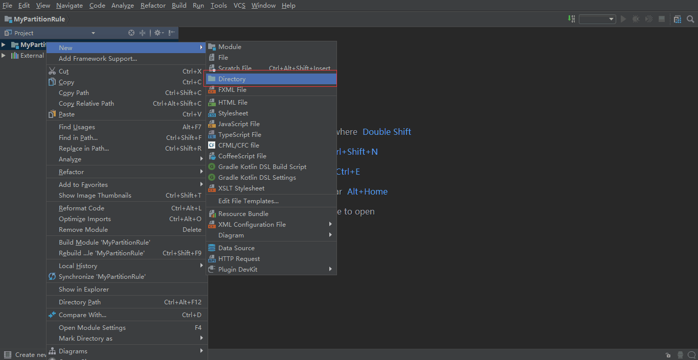
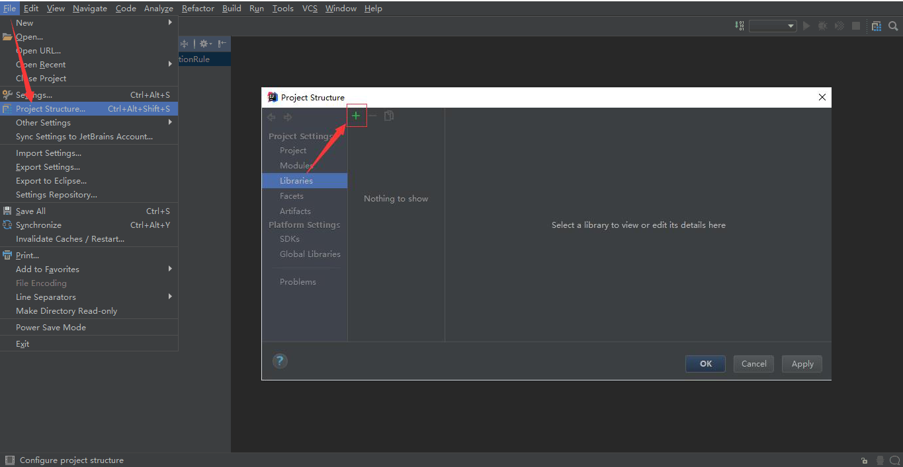
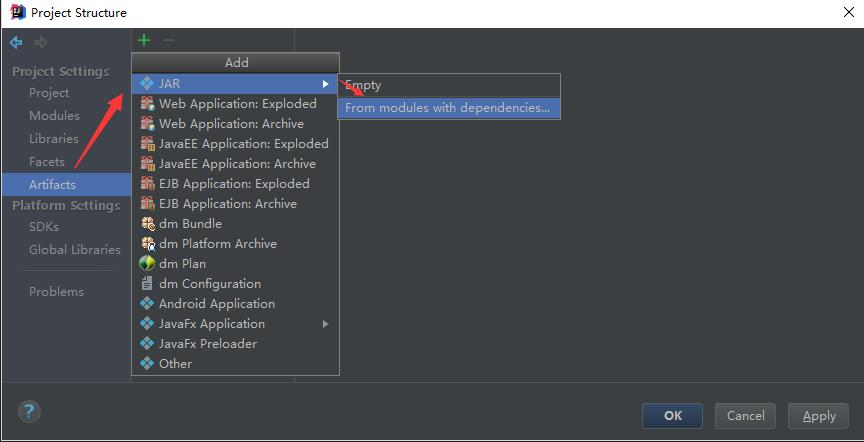
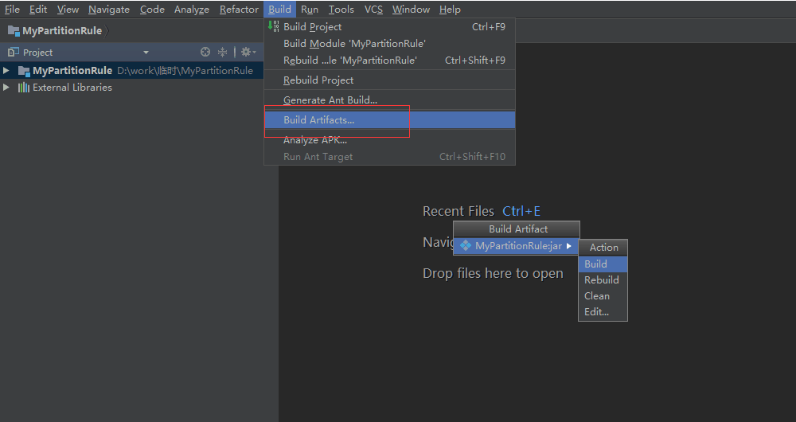

## 1.9 自定义拆分算法

### 1.9.1 工作原理

#### 1.9.1.1 函数的加载

  路由函数的加载发生在dble启动或重载时。



1. dble读取sharding.xml时，根据用户配置的<function>标签的class属性
2. dble通过Java的反射机制，从$DBLE_HOME/lib的jar包中，找到对应的jar（里的class文件），加载同名的类并创建对象
3. dble会逐个扫描<function>中的<property>标签，并根据name属性来调用路由函数的对应setter，以此完成赋值过程——例如，如果用户配置了<property name="partitionCount">2</property>，那么dble就会尝试找路由函数中叫做setPartitionCount()的方法，并将字符串“2”传给它
4. dble调用路由函数的selfCheck()方法，执行函数编写者制定的检查动作，例如检查赋值得到的变量值是否有问题
5. dble调用路由函数的init()方法，执行函数编写者制定的准备动作，例如创建后面要用到的一些中间变量

#### 1.9.1.2 路由计算

  路由函数接受用户SQL中的分片字段的值，计算出这个值对应的数据记录应该在哪个编号的数据分片（逻辑分片）上，DBLE从而知道把这个SQL准确发到这些分片上。


#### 1.9.1.3 参数查询

  用户通过管理端口（默认9066），通过SHOW @@ALGORITHM WHERE SCHEMA=? AND TABLE=?来查询表上的路由算法时，dble调用路由算法的getAllProperties()方法，直接从内存中获取路由信息的配置。

``` sql
mysql> show @@algorithm where schema=testdb and table=seqtest;
+-----------------+----------------------------------------------------+
| KEY             | VALUE                                              |
+-----------------+----------------------------------------------------+
| TYPE            | SHARDING TABLE                                     |
| COLUMN          | ID                                                 |
| CLASS           | com.actiontech.dble.route.function.PartitionByLong |
| partitionCount  | 2                                                  |
| partitionLength | 1                                                  |
+-----------------+----------------------------------------------------+
5 rows in set (0.05 sec)
```

### 1.9.2 开发和部署

#### 1.9.2.1 开发

  开发时，理论上只需要引入AbstractPartitionAlgorithm抽象类和RuleAlgorithm接口及它们的依赖类就可以了。但实际上AbstractPartitionAlgorithm抽象类依赖了TableConfig类，由此开启了环游世界的依赖之旅。因此，现实的操作还是引用整个DBLE项目的源代码会比较直接方便。

  开发一个新的路由函数时，必须给这个路由函数的开发新建项目，然后再引用DBLE项目（项目引用项目的方式）。而**不应该**直接打开DBLE的项目，然后在DBLE的项目里面直接新建源代码来直接开发（内嵌开发方式）。通过遵循这个做法，会有以下好处：

  1. 路由函数可以独立打包，直接去看路由函数的jar包版本就能够确认函数版本；而把路由函数嵌到DBLE里的话，就很容易出现DBLE版本一样，但不清楚里面的函数是什么版本的窘况
  2. 路由函数的递进可以更加自由，如果DBLE的AbstractPartitionAlgorithm抽象类和RuleAlgorithm接口没有变动，同一版本的路由函数可以延续使用好几个版本的DBLE，而不需要每次DBLE释放新版就得去重编译
  3. 可以让路由函数中的受保护代码免受DBLE自身的开源协议影响

#### 1.9.2.2 部署

  完成开发之后，成品打包成jar包进行发布，而**不要**直接发布class和依赖的library（其他项目的jar包或class文件）。

  让DBLE使用上新的路由函数的过程：

  1. 将成品jar包放入$DBLE_HOME/lib目录中
  2. 调整jar包的所有者权限（chown）和文件权限（chmod），使之与其他$DBLE_HOME/lib目录里的jar包一样
  3. 按照原来的思路配置rule.xml，但需要注意<function>标签的class属性必须要填写新的路由函数**类**的完全限定名（Fully Qualified Name），例如net.john.dble.route.functions.NewFunction
  4. 配置逻辑表之类的必要信息，**重启**DBLE后，自动生效。

### 1.9.3 接口规范

 每个路由函数本质上就是一个继承了AbstractPartitionAlgorithm抽象类，并且实现了RuleAlgorithm接口的一个类。下面以内置的com.actiontech.dble.route.function.PartitionByLong为例，介绍实现一个路由函数类所需要做的最小工作（必要工作）。



#### 1.9.3.1 配置项setters

 在sharding.xml中，我们需要配置partitionCount和partitionLength两个配置项。

``` xml
<function name="hashmod" class="com">
  <property name="partitionCount">4</property>
  <property name="partitionLength">1</property>
</function>
```

  为了让dble在函数加载过程中，能够认出这里的partitionCount（值为4）和partitionLength（值为1），因此PartitionByLong类中，就必须有属性设置方法（setter）setPartitionCount()和setPartitionLength()。而因为sharding.xml是个文本型的XML文件，所以这些函数的传入参数就只能是一个String，数据类型转换和预处理的动作就由这些setter来处理了。

``` java
public void setPartitionCount(String partitionCount) {
  this.count = toIntArray(partitionCount);
	/* 参考本文的getAllProperties()的说明 */
  propertiesMap.put("partitionCount", partitionCount);
}

public void setPartitionLength(String partitionLength) {
  this.length = toIntArray(partitionLength);
	/* 参考本文的getAllProperties()的说明 */
  propertiesMap.put("partitionLength", partitionLength);
}
```

#### 1.9.3.2 selfCheck()

  在函数加载过程中，完成了配置项赋值之后，dble会调用这个路由函数对象的selfCheck()方法，让这个对象自我检查刚才读进来的配置项的值，放在一起是不是有问题。如果有问题的话，路由函数编写者在这时候，可以通过抛出RuntimeException来进行报错，并终止dble使用这个函数，当然，由于RuntimeException的霸道，dble自己也会因此而报错退出。

  由于selfCheck()是RuleAlgorithm接口的要求，而且AbstractPartitionAlgorithm抽象类没又实现它，对于想偷懒或者没有必要进行这个检查的人来说，还是需要自行定义一个空的同名方法来实现它。

``` java
@Override
public void selfCheck() {
}
```

#### 1.9.3.3 init()

  在函数加载过程的最后，dble调用这个路由函数对象的init()方法，让这个对象完成一些内部的初始化工作。

  在我们的例子PartitionByLong里，通过init()方法准备了PartitionUtil对象，其中有一个哈希值的范围与逻辑分片号对应的数组，这样在后面的路由计算时就能通过查数组来加速得到结果。

``` java
@Override
public void init() {
  partitionUtil = new PartitionUtil(count, length);

  initHashCode();
}
```

#### 1.9.3.4 calculate()和calculateRange()

  dble执行用户SQL时，根据用户SQL的不同，调用calculate()或calculateRange()来确定用户的SQL应该发到哪个数据分片上去。

  从IPO（Input-Process-Output）来分析，calculate()和calculateRange()的工作原理是一样的：
  * Input：用户SQL中的分片字段值
  * Output：用户SQL应该要发往的数据分片的编号
  * Process：Input与Output转换的计算过程，由函数开发者编写

  calculate()和calculateRange()的使用场景不同，导致它们存在着一些微小的差异。

| 函数名           |调用场景                                                                      |Input      |Output       |
|------------------|------------------------------------------------------------------------------|-----------|-------------|
| calculate()      | 用户SQL里分片字段的值是单值的情况，例如 ... WHERE sharding_key = 1           | 1个String | 1个Integer  |
| calculateRange() | 用户SQL里分片字段的值是连续范围，例如 ... WHERE sharding_key BETWEEN 1 AND 5 | 2个String | Integer数组 |

``` java
@Override
public Integer calculate(String columnValue) {
  try {
    if (columnValue == null || columnValue.equalsIgnoreCase("NULL")) {
      return 0;
    }
    long key = Long.parseLong(columnValue);
    return calculate(key);
  } catch (NumberFormatException e) {
    throw new IllegalArgumentException("columnValue:" + columnValue + " Please eliminate any quote and non number within it.", e);
  }
}

@Override
public Integer[] calculateRange(String beginValue, String endValue) {
  long begin = 0;
  long end = 0;
  try {
    begin = Long.parseLong(beginValue);
    end = Long.parseLong(endValue);
  } catch (NumberFormatException e) {
    return new Integer[0];
  }
  int partitionLength = partitionUtil.getPartitionLength();
  if (end - begin >= partitionLength || begin > end) { //TODO: optimize begin > end
    return new Integer[0];
  }
  Integer beginNode = calculate(begin);
  Integer endNode = calculate(end);

  if (endNode > beginNode || (endNode.equals(beginNode) && partitionUtil.isSingleNode(begin, end))) {
    int len = endNode - beginNode + 1;
    Integer[] re = new Integer[len];

    for (int i = 0; i < len; i++) {
      re[i] = beginNode + i;
    }
    return re;
  } else {
    int split = partitionUtil.getSegmentLength() - beginNode;
    int len = split + endNode + 1;
    if (endNode.equals(beginNode)) {
      //remove duplicate
      len--;
    }
    Integer[] re = new Integer[len];
    for (int i = 0; i < split; i++) {
      re[i] = beginNode + i;
    }
    for (int i = split; i < len; i++) {
      re[i] = i - split;
    }
    return re;
  }
}
```

#### 1.9.3.5 getAllProperties()

  当用户找dble要路由函数的配置信息时，dble通过访问路由函数的getAllProperties()来获得一个<配置项, 配置值>的哈希表，然后将里面的内容逐项返回给用户。

  getAllProperties()是RuleAlgorithm接口所规定要实现的，但为了简化编写新的路由函数的工作，在AbstractPartitionAlgorithm抽象类里，定义了propertiesMap这个私有变量，并且把“将propertiesMap交出去”作为了实现了getAllProperties()方法的默认实现。一般来说，这个默认的实现能满足需求，而新路由函数编写者只需要在配置项setters处理用户配置时，将<配置项, 配置值>给put()进propertiesMap里就好了。

``` java
@Override
public Map<String, String> getAllProperties() {
  return propertiesMap;
}
```

### 1.9.4 内置路由函数的缩写与类名对照表

  DBLE内置的路由函数都位于com.actiontech.dble.route.function命名空间。但实际配置sharding.xml的时候，却不用写那么长的完全限定名，这其实都是XMLRuleLoader类做了转换，因此实现了简写。下面就是7个内置函数的类名和它们的简写。

| 简写名         | 完整类名                      |
|----------------|-------------------------------|
| date           | PartitionByDate               |
| enum           | PartitionByFileMap            |
| hash           | PartitionByLong               |
| jumpstringhash | PartitionByJumpConsistentHash |
| numberrange    | AutoPartitionByLong           |
| patternrange   | PartitionByPattern            |
| stringhash     | PartitionByString             |

### 1.9.5 IntelliJ IDEA中的实践

#### 1.9.5.0 前提

1. 安装java开发环境
2. 准备好dble的最新的release版本jar包，以下是2.19.05.0 安装包下载链接：https://github.com/actiontech/dble/releases/download/2.19.05.0%2Ftag/actiontech-dble-2.19.05.0.tar.gz，解压后在lib目录中可以找到dble的对应版本的jar包。

#### 1.9.5.1 创建 java 项目

创建简单的java项目，点击红框中Project



点击Project后弹出框中默认选中java，若没有选中，手动选中后一路点击next，填写恰当的项目名即可。

#### 1.9.5.2 引入 dble jar 包

右击新建的java项目，新建lib目录



将 dble 的jar包复制到lib目录下。

将lib中的dble jar 包添加为项目的依赖。



点击加号之后选中文件系统中的lib目录后加入即可

#### 1.9.5.3 自定义分片算法类

在新建项目中自定义算法类，具体方式请参照上文。

#### 1.9.5.4 新建Artifacts

选中Project Strcucture后，点击Artifacts，在弹出的对话框中直接点击OK。



#### 1.9.5.5 编译jar包

选择菜单栏中Build下的Build Artifacts，在弹出的对话框中选中自定义的Artifact后build。



编译完成之后，在项目路径下会生成一个out文件夹，在artifact子文件夹下可以找到生成的jar包。